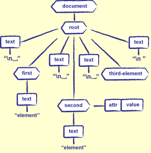
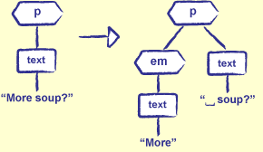

##Working with XML files in Python
Based on original materials by Greg Wilson and Andrew Walker

Introduction
------------

XML is becoming the standard way to store everything from web pages to astronomical data. There is a bewildering variety of tools for dealing with it. In this tutorial we will look at how to process and modify XML. We will cover the basics but if you are interested here is some recommended reading:

-   [Castro 2002](bib.html#bib:castro-html) if all you care about
        is HTML
-   [Castro 2000](bib.html#bib:castro-xml) if you want to know
        more about XML
-   [Harold 2004](bib.html#bib:harold-effective-xml) if you want
        to become an expert

A bit of history (to help you understand the context).In 1969-1986 Standard Generalized Markup Language (SGML) emerged. It was developed by Charles Goldfarb and others at IBM. It was a way of adding information to medical and legal documents so that computers could process them. It had a very complex specification (over 500 pages). In 1989: Tim Berners-Lee creates HyperText Markup Language (HTML) for the World Wide Web. It was much (much) simpler than SGML. Anyone could write it, so everyone did.

The problem was HTML had a small, fixed set of tags. Everyone wanted to add new ones. So the solution was to create a standard way to define a set of tags, and the relationships between them. The first version of [XML]({{page.root}}/book/glossary.html#xml) was standardized in 1998. It is a set of rules for defining markup languages, much more complex than HTML, but still simpler than SGMLNew version of HTML called XHTML was also defined, it was like HTML, but obeys all XML rules. There still is a lot of non-XML compliant HTML out there.

Formatting Rules
-------------------

A basic XML [document]({{page.root}}/book/glossary.html#document) contains [elements]({{page.root}}/book/glossary.html#element) and    [text]({{page.root}}/book/glossary.html#text). Full spec allows for external entity references, processing instructions, and other fun.

Elements are shown using [tags]({{page.root}}/book/glossary.html#tag-xml):  
    -   Must be enclosed in angle brackets `<>`  
    -   Full form: `tagname`...  
    -   Short form (if the element doesn't contain anything): `tagname`

####Document Structure
-   Elements must be properly nested
    -   If Y starts inside X, Y must end before X ends
    -   So `<X>...<Y>...</Y></X>` is legal...
    -   ...but `<X>...<Y>...</X></Y>` is not
-   Every document must have a single root element
    -   I.e., a single element must enclose everything else
-   Specific XML dialects may restrict which elements can appear inside
    which others
    -   XHTML is very liberal
    -   MathML (Mathematical Markup Language) is stricter

####Text
-   Text is normal printable text
-   Must use escape sequences to represent `<` and `>`
    -   In XML, written `&name;`

**Attributes**  

-   Elements can be customized by giving them
    [attributes]({{page.root}}/book/glossary.html#attribute). The attributes provide additional information about the element.  
    * They need to be rnclosed in the opening tag. Let's look at HTML example: 
    * `<h1 align="center">A Centered Heading</h1>`  
    * `<p class="disclaimer">This planet provided as-is.</p>`  
-   An attribute name may appear at most once in any element  
    -   Like keys in a dictionary  
    -   So `<p align="left" align="right">...</p>` is illegal
-   Values *must* be quoted  
    -   Old-style browsers accepted `<p align=center>...<p>`, but modern
        parsers will reject it  
    -   Must use escape sequences for angle brackets, quotes, etc.
        inside values

**Attributes Vs. Elements**

-   Use attributes when:
    -   Each value can occur at most once for any element
    -   The order of the values doesn't matter
    -   Those values have no internal structure
-   In all other cases, use nested elements
    -   If you have to parse an attribute's value to figure out what it
        means, use an element instead


###Element Tree library in Python

Python's standard library includes [`Element Tree`](https://docs.python.org/2/library/xml.etree.elementtree.html#)  library (xml.etree.ElementTree typically shortened to ET). `Element Tree` provides easy ways to manipulate XML documents. ET is also a widely used library so learning it will help you in working with the code written by other developers.


#####XML Tree Example
XML documents have hierarchical structure. 

	<root>
	  <first>element</first>
	  <second attr="value">element</second>
	  <third-element/>
	</root>




Figure 21.5: A XML Tree


#####Creating a Tree using ElementTree and extracting element object 'root'

Example: file "mercury.xml"

	<?xml version="1.0" encoding="utf-8"?>
	<planet name="Mercury">
	  <period units="days">87.97</period>
	</planet>

        import xml.etree.ElementTree as etree
	tree = etree.parse('mercury.xml')
	root = tree.getroot()
	print root.attrib
	
Output:
	
	{'name': 'Mercury'}
	
Listing all root's children
   
    for child in root:
    	print "tag=",child.tag, " attrib=",child.attrib
    	
    	
Output:

	tag=period  attrib={'units': 'days'}
    
Elements are stored as a list so we can access the children using list indes:

	print print root[0].tag, root[0].attrib

Output:

	period {'units': 'days'}
    	
In ElementTree the attributes are stored as dictionaries:

    	print child_of_root.attrib['units']

Output:

	days
	
#####Finding particular elements:
We know now how to get hold of all elements in the XML document by recursively extracting all the children using the `for` loop. But the ET library comes with methods which allow for iterating over the elements immediately below a given element. The `iter` method does exactly that (using "depth-first iteration (DFS)"). `iter` method is available for both ElementTree and Element objects.  

Using iter for ElementTree:

	for element in tree.iter():
    		print element.tag, element.attrib

Output:

	planet {'name': 'Mercury'}
	period {'units': 'days'}

Using iter for Element:

	for element in root.iter():
    		print element.tag

Output

	planet
	period


We can use iter to find particular element:

    for element in root.iter('period'):
    	print element.attrib
    	print element.text


####Other Ways To Create XML Documents

-   Can also create a tree by parsing a string

	src = '''<planet name="Venus">
	  <period units="days">224.7</period>
	</planet>'''

	doc = xml.dom.minidom.parseString(src)
	print doc.toxml('utf-8')

The output file create-venus.out

	<?xml version="1.0" encoding="utf-8"?>
	<planet name="Venus">
  	<period units="days">224.7</period>
	</planet>


-   Or by building a tree by hand

``` {file="xml/create-mars.py"}

	import xml.dom.minidom

	impl = xml.dom.minidom.getDOMImplementation()

	doc = impl.createDocument(None, 'planet', None)
	root = doc.documentElement
	root.setAttribute('name', 'Mars')

	period = doc.createElement('period')
	root.appendChild(period)

	text = doc.createTextNode('686.98')
	period.appendChild(text)

	print doc.toxml('utf-8')


``` {.out file="xml/create-mars.out"}
<?xml version="1.0" encoding="utf-8"?>
<planet name="Mars"><period>686.98</period></planet>
```

-   Notice that the output of the preceding example wasn't nicely
    indented
    -   Because we didn't create text nodes containing carriage returns
        and blanks
    -   Most machine-generated XML doesn't


####Finding Nodes

-   Often want to do things to all elements of a particular type
    -   E.g., find all `experimenter` nodes, extract names, and print a
        sorted list
-   Use the `getElementsByTagName` method to do this
    -   Returns a list of all the descendants of a node with the
        specified tag

get-by-tag.py

	import xml.dom.minidom

	src = '''<heavenly_bodies>
	  <planet name="Mercury"/>
	  <planet name="Venus"/>
	  <planet name="Earth"/>
	  <moon name="Moon"/>
	  <planet name="Mars"/>
	  <moon name="Phobos"/>
	  <moon name="Deimos"/>
	</heavenly_bodies>'''

	doc = xml.dom.minidom.parseString(src)
	for node in doc.getElementsByTagName('moon'):
	    print node.getAttribute('name')


{.out file="xml/get-by-tag.out"}

	Moon
	Phobos
	Deimos


-   Question: what happens if you add or delete nodes while looping over
    this list?

####Walking a Tree

-   Often want to visit each node in the tree
    -   E.g., print an outline of the document showing element nesting
-   Node's type is stored in a member variable called `nodeType`
    -   `ELEMENT_NODE`, `TEXT_NODE`, `ATTRIBUTE_NODE`, `DOCUMENT_NODE`
-   If a node is an element, its children are stored in a read-only list
    called `childNodes`
-   If a node is a text node, the actual text is in the member `data`

####Recursive Tree Walker

recurse.py

	import xml.dom.minidom

	src = '''<solarsystem>
	<planet name="Mercury"><period units="days">87.97</period></planet>
	<planet name="Venus"><period units="days">224.7</period></planet>
	<planet name="Earth"><period units="days">365.26</period></planet>
	</solarsystem>


	def walkTree(currentNode, indent=0):
    	spaces = ' ' * indent
	    if currentNode.nodeType == currentNode.TEXT_NODE:
	        print spaces + 'TEXT' + ' (%d)' % len(currentNode.data)
	    else:
	        print spaces + currentNode.tagName
	        for child in currentNode.childNodes:
    	        walkTree(child, indent+1)

	doc = xml.dom.minidom.parseString(src)
	walkTree(doc.documentElement)


.out recurse.out

	solarsystem
	 TEXT (1)
	 planet
	  period
	   TEXT (5)
	 TEXT (1)
	 planet
	  period
	   TEXT (5)
	 TEXT (1)
	 planet
	  period
	   TEXT (6)
	 TEXT (1)


-   Traversing a tree like this is just one of many recurring patterns
    in object-oriented programming
    -   We'll discuss them briefly in [Summary](summary.html)

####Modifying the Tree


-   Modifying trees in place is a little bit tricky
    -   Helps to draw lots of pictures
-   Example: want to *emphasize* the first word of each paragraph
    -   Get the text node below the paragraph
    -   Take off the first word
    -   Insert a new `em` element whose only child is a text node
        containing that word



Figure 21.6: Modifying the DOM Tree

####Complications


-   But what if the first child of the paragraph already has some markup
    around it?
    -   E.g., what if the paragraph starts with a link?
-   Could just wrap the first child with `em`
    -   But if (for example) the link contains several words, this will
        look wrong
-   We'll ignore this problem for now

####Solution

-   Step 1: find all the paragraphs using `getElementsByTagName`, and
    iterate over them

modify-tree.py section="emphasize"

	def emphasize(doc):
	    paragraphs = doc.getElementsByTagName('p')
	    for para in paragraphs:
	        first = para.firstChild
	        if first.nodeType == first.TEXT_NODE:
	            emphasizeText(doc, para, first)


-   Step 2: break the paragraph text into pieces, and handle each piece
    in turn
    -   Create a new node for each piece
    -   Push it onto the front of the paragraph's child list
    -   Once they've all been handled, get rid of the original text node

modify-tree.py" section="func"

	def emphasizeText(doc, para, textNode):

 	   # Look for optional spaces, a word, and the rest of the paragraph.
	    m = re.match(r'^(\s*)(\S*)\b(.*)$', str(textNode.data))
	    if not m:
	        return
	    leadingSpace, firstWord, restOfText = m.groups()
	    if not firstWord:
	        return

	    # If there's text after the first word, re-save it.
	    if restOfText:
	        restOfText = doc.createTextNode(restOfText)
	        para.insertBefore(restOfText, para.firstChild)

	    # Emphasize the first word.
	    emph = doc.createElement('em')
	    emph.appendChild(doc.createTextNode(firstWord))
	    para.insertBefore(emph, para.firstChild)

	    # If there's leading space, re-save it.
	    if leadingSpace:
    	    leadingSpace = doc.createTextNode(leadingSpace)
	        para.insertBefore(leadingSpace, para.firstChild)

    	# Get rid of the original text.
	    para.removeChild(textNode)


####Not Finished Yet

-   Part 3: test it
    -   Yes, it really is part of the program

xml/modify-tree.py" section="test"

	if __name__ == '__main__':

    	src = '''<html><body>
	<p>First paragraph.</p>
	<p>Second paragraph contains <em>emphasis</em>.</p>
	<p>Third paragraph.</p>
	</body></html>

	    doc = xml.dom.minidom.parseString(src)
	    emphasize(doc)
	    print doc.toxml('utf-8')


{.out file="xml/modify-tree.out"}

	<?xml version="1.0" encoding="utf-8"?>
	<html><body>
	<p><em>First</em> paragraph.</p>
	<p><em>Second</em> paragraph contains <em>emphasis</em>.</p>
	<p><em>Third</em> paragraph.</p>
	</body></html>


####Summary

-   There's a lot of hype in hypertext
    -   Haven't yet heard anyone claim that XML will cure the common
        cold, but I'm sure it's been said
-   Pros:
    -   One set of rules for people to learn
    -   Never have to write a parser again
        -   At least, the low-level syntactic bits---still need to
            figure out what all those tags *mean*
-   Cons:
    -   Raw XML is hard to read
        -   Particularly if it has been generated by a machine
    -   A lot of data isn't actually trees
        -   When storing a 2D matrix or a table, you have to organize
            data by row or by column...
        -   ...either of which makes the other hard to access
    -   There are a lot of complications and subtleties
        -   Most applications ignore most of them
        -   Which means that they fail (usually badly) when confronted
            with something outside the subset they understand
-   Like Inglish speling, it's here to stay
